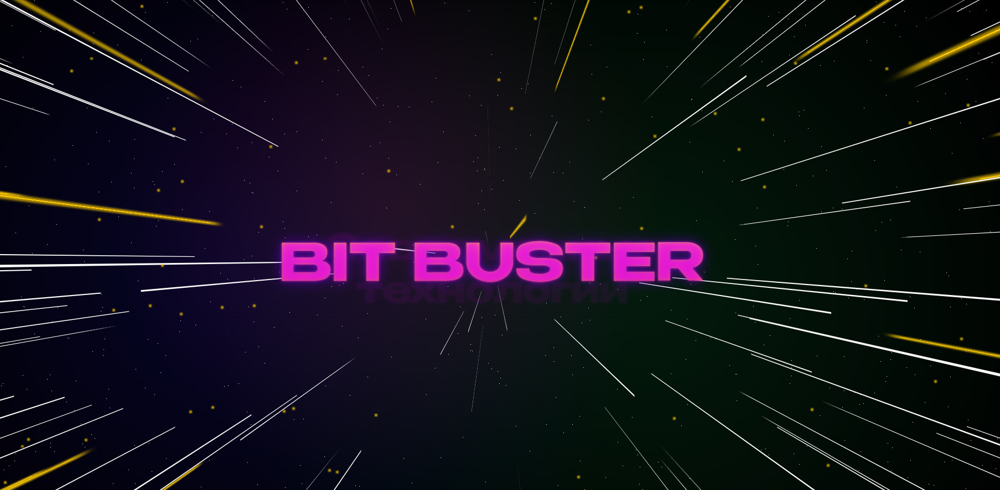

<h1 align="center">Тестовое задание Hyperloop</h1>

<image src="./src/images/image.png" alt="Hyperloop">

### О проекте:

Проект написан на React. Это 2х страничное приложение с анимацией перехода между ними. Перейти можно по колёсику мыши, либо кликнув по названию. Анимация выполнена в CSS с помощью @keyframes без сторонних библиотек. Верстка адаптивная "Mobile First" для разрешений Mobile, Tablet, Desktop. Для запуска проекта введите в редакторе кода **npm run start** либо перейдите по ссылке ниже.
Чтобы перейти на другую страницу нужно повернуть колёсико на себя, либо нажать на надпись. Для обратного перерхода поверните колёсико от себя, либо нажмите на надпись.

### Используемый стек

### [Ссылка на проект](https://bjuice1984.github.io/hyper-loop/)